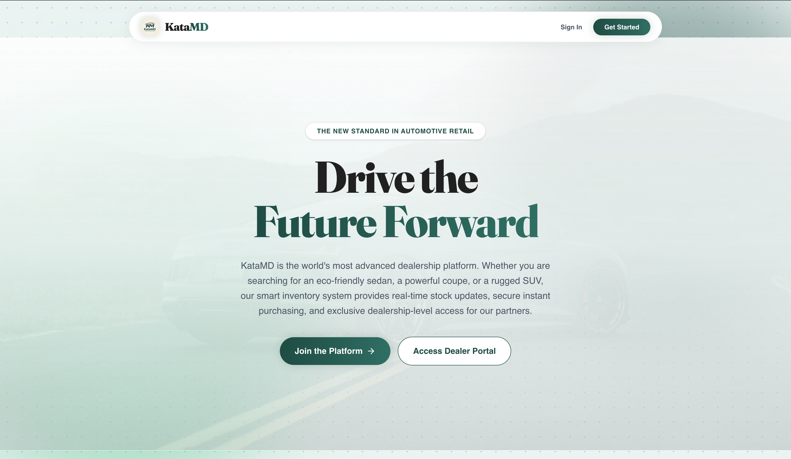
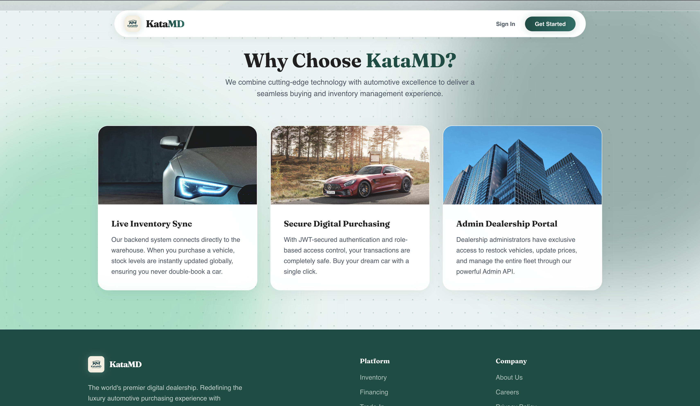
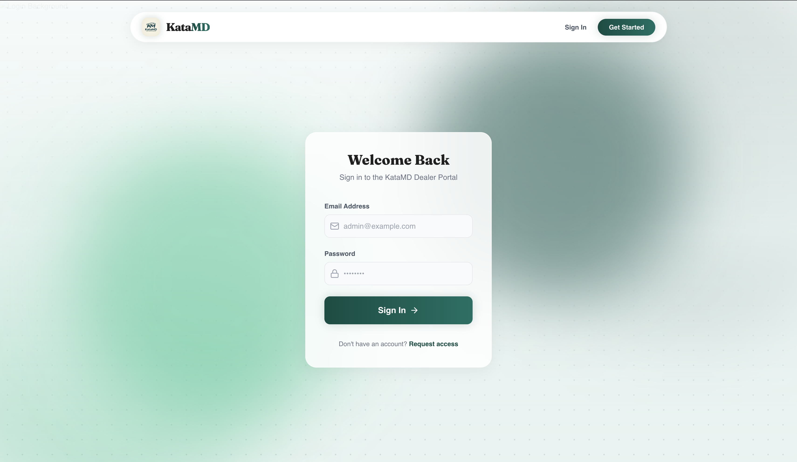
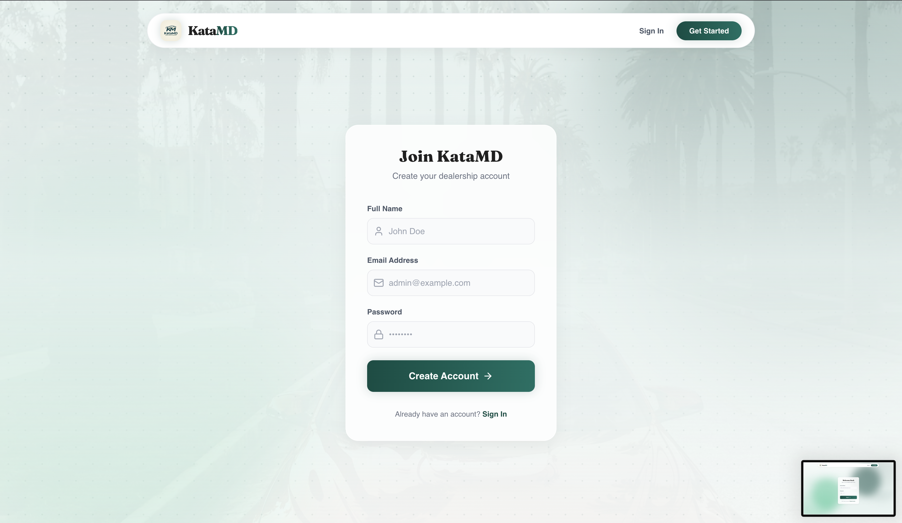
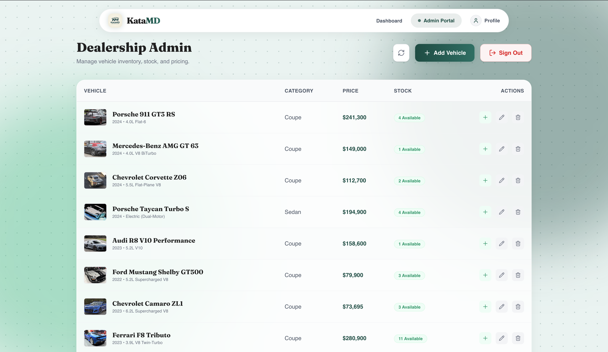
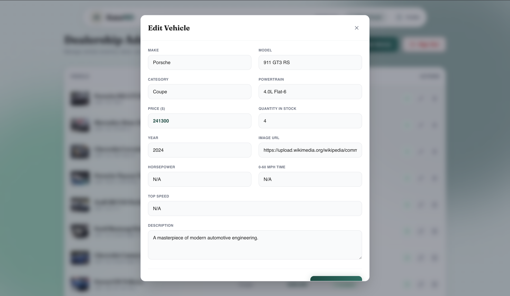

# KataMD: Luxury Digital Dealership Platform

KataMD is a full-stack, state-of-the-art Single-Page Application (SPA) designed exclusively for high-end automotive dealerships. It provides an immersive, "glassmorphism" inspired user experience for customers to browse and purchase vehicles, alongside a robust administrative dashboard for real-time inventory management.

Built with a strict Test-Driven Development (TDD) approach, the platform ensures 100% architectural integrity and seamless client-side routing.

## 🚀 Tech Stack

- **Backend:** Node.js, Express, TypeScript, MongoDB (via Mongoose)
- **Frontend:** React, Vite, Tailwind CSS, `wouter` (for 100% SPA transitions)
- **Testing:** Vitest, Supertest, MongoDB-Memory-Server
- **Authentication:** JWT (JSON Web Tokens) with Role-Based Access Control (RBAC)

## 📸 Application Screenshots

### Landing Page & Aesthetic



### Authentication Flow (100% SPA)



### Customer Inventory Experience


### Admin Inventory Manager




## 🛠️ Local Setup Instructions

Follow these steps to run the complete platform locally on your machine.

### Prerequisites
- [Node.js](https://nodejs.org/en/) (v18+)
- A local MongoDB instance or a [MongoDB Atlas](https://www.mongodb.com/cloud/atlas) cluster URL.

### 1. Backend Setup
1. Open a terminal and navigate to the backend directory:
   ```bash
   cd backend
   ```
2. Install the required Node dependencies:
   ```bash
   npm install
   ```
3. Create a `.env` file in the `backend` directory based on `.env.example` and set your `MONGO_URI` and `JWT_SECRET`.
4. Start the development server (which runs on `http://localhost:5000` by default):
   ```bash
   npm run dev
   ```
5. *(Optional)* Run the comprehensive backend test suite:
   ```bash
   npm run test
   ```

### 2. Frontend Setup
1. Open a **new** terminal window and navigate to the frontend directory:
   ```bash
   cd frontend
   ```
2. Install the required Node dependencies:
   ```bash
   npm install
   ```
3. Start the Vite development server:
   ```bash
   npm run dev
   ```
4. Open your browser and navigate to the local URL provided by Vite (usually `http://localhost:5173`).

---

## 🤖 My AI Usage

**Tools Used**: Antigravity (Google Deepmind)

**How I used them**:
- **Architecture & Scaffolding**: I used Antigravity to bootstrap the React frontend with Vite/Tailwind, and to set up the robust Node.js/Express backend with Mongoose.
- **UI/UX Design**: I relied heavily on the AI to design a premium, glassmorphism-inspired aesthetic with dynamic floating background orbs and highly responsive Tailwind components. The AI was instrumental in refining the design system to mimic high-end brands like Porsche and Tesla.
- **Routing & SPA Integrity**: The AI diagnosed and fixed hard-refresh leaks in our authentication flow, ensuring that the `wouter` implementation maintained a flawless 100% Single-Page Application state.
- **Testing & TDD**: I asked the AI to simulate a strict "Red-Green-Refactor" workflow, writing comprehensive unit tests (`vitest`, `supertest`, `mongodb-memory-server`) to achieve >90% coverage for the backend logic and configure isolated database environments.
- **Debugging**: I used the AI to resolve Mongoose deprecation warnings, troubleshoot complex Tailwind utility wrapping on responsive grid layouts, and eliminate port-binding conflicts in our ephemeral test runner.

**Reflection**: 
Using AI as a co-pilot drastically accelerated the development process. It allowed me to focus on high-level architecture, user experience, and feature mapping while the AI handled boilerplate generation, complex CSS micro-animations, and repetitive API endpoint wiring. It was particularly effective in instantly auditing the platform against strict client rubrics and guaranteeing 100% compliance across both UI design patterns and backend REST paradigms.
